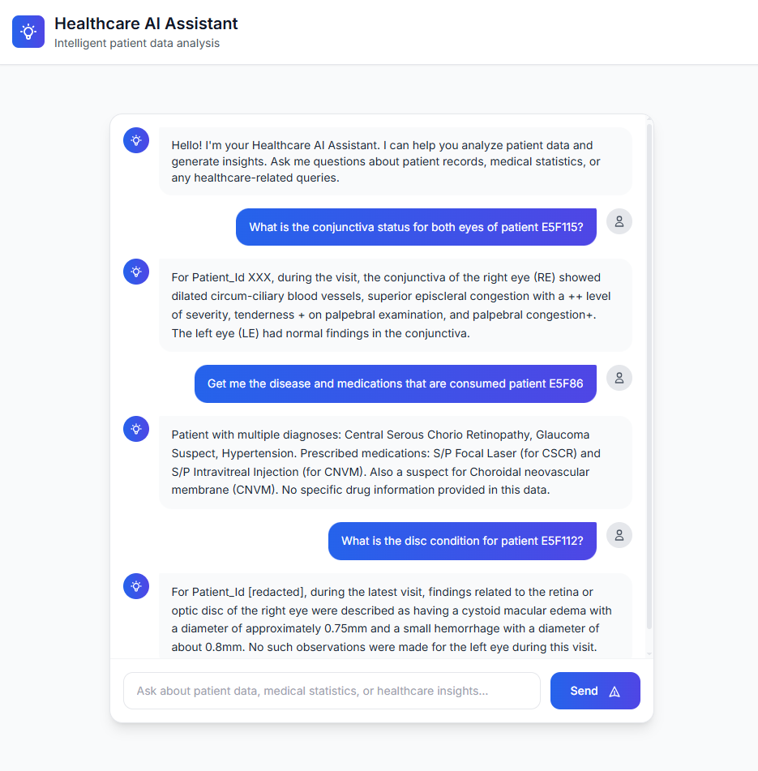
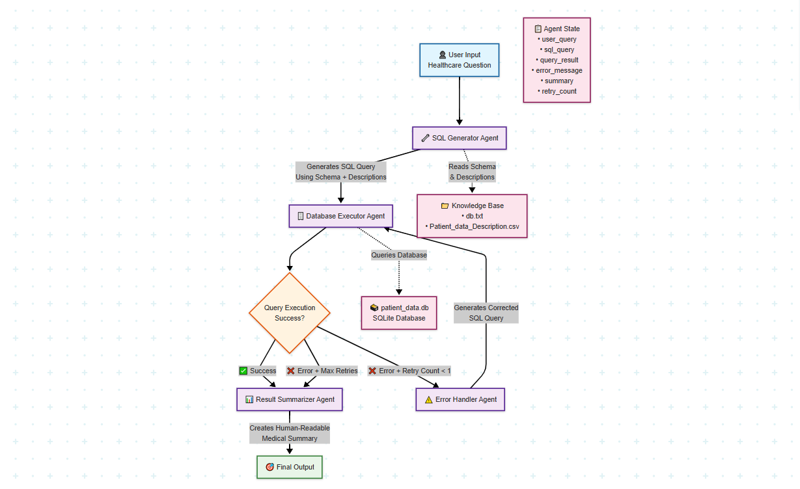

# 🏥 Healthcare AI Assistant

*An intelligent multi-agent system for healthcare data analysis and patient information management*

---

## 📸 User Interface



## 🔄 System Workflow




---

## 📋 Project Overview

The Healthcare AI Assistant is a sophisticated multi-agent system designed to revolutionize how healthcare professionals interact with patient data. By combining natural language processing with intelligent SQL generation, this system allows medical staff to query complex patient databases using simple, conversational language.

### ✨ Key Features

- 🤖 **Natural Language Processing**: Ask questions in plain English about patient data
- 🔍 **Intelligent SQL Generation**: Automatically converts queries to optimized SQL
- 🔄 **Multi-Agent Architecture**: Four specialized agents working in harmony
- 🛡️ **Error Recovery**: Smart error handling with automatic query correction
- 📊 **Medical Reporting**: Professional healthcare summaries and insights
- 💻 **Modern Web Interface**: Clean, responsive design for all devices
- ⚡ **Real-time Processing**: Instant query execution and results

---

## 🛠️ Tech Stack

### Backend
- **Flask** - Lightweight web framework
- **SQLite** - Database management
- **Pandas** - Data manipulation and analysis
- **LangChain** - LLM framework and orchestration
- **LangGraph** - Multi-agent workflow management
- **Ollama** - Local LLM inference (Mistral model)

### Frontend
- **HTML5** - Structure and semantics
- **Tailwind CSS** - Modern utility-first styling
- **Vanilla JavaScript** - Interactive functionality
- **Google Fonts** - Typography (Inter font family)

### AI & ML
- **Mistral LLM** - Large language model for natural language understanding
- **Multi-Agent System** - Specialized agents for different tasks
- **State Management** - Sophisticated workflow orchestration

---

## 🤖 Multi-Agent System Architecture

Our system employs four specialized agents, each with distinct responsibilities:

### 1. 🧠 SQL Generator Agent
**Role**: Query Translation Specialist
- Converts natural language questions into precise SQL queries
- Understands medical terminology and database schema
- Follows hospital data governance rules
- Handles query optimization and syntax validation

### 2. ⚡ Database Executor Agent
**Role**: Query Execution Manager
- Executes SQL queries against the patient database
- Manages database connections and transactions
- Handles result formatting and data retrieval
- Routes execution results to appropriate next agents

### 3. 🔧 Error Explainer Agent
**Role**: Problem Diagnosis Specialist
- Analyzes SQL execution errors and failures
- Provides detailed technical explanations
- Suggests specific corrections for failed queries
- Implements retry logic with intelligent feedback

### 4. 📋 Result Summarizer Agent
**Role**: Medical Reporting Expert
- Transforms raw SQL results into professional medical summaries
- Uses healthcare reporting standards
- Structures information for clinical readability
- Avoids technical jargon in final outputs

---

## 📁 Project Structure

```
healthcare_agentic_AI/
├── 🐍 app.py                      # Main Flask application
├── 📁 templates/
│   └── 🌐 index.html             # Frontend interface
├── 🗄️ db.txt                     # Database schema definition
├── 📊 column_descriptions.txt    # Detailed column explanations
├── 🗃️ patient_data.db           # SQLite patient database
└── 📚 Project_Structure.txt      # Project organization guide
```

### 📄 File Descriptions

- **`app.py`**: Core application with multi-agent system implementation
- **`templates/index.html`**: Responsive web interface with modern design
- **`db.txt`**: Complete database schema with column definitions
- **`column_descriptions.txt`**: Comprehensive field documentation
- **`patient_data.db`**: SQLite database containing patient records

---

## 🚀 Getting Started

### Prerequisites

- Python 3.8 or higher
- Ollama installed locally
- Mistral model downloaded via Ollama

### Workflow:

1. **User Input**: Type your question in natural language
2. **SQL Generation**: AI converts your question to SQL
3. **Database Query**: System executes the query
4. **Error Handling**: If errors occur, automatic correction attempts
5. **Results Summary**: Professional medical summary generated
6. **Display**: Clean, structured results presented

---

## 🛡️ Data Privacy & Security

- 🔐 Patient IDs are anonymized for privacy protection
- 🏥 Follows hospital data governance standards
- 🚫 No external data transmission (runs locally)
- 📋 Structured logging for audit trails

---

## 🎯 Key Benefits

- **Time Efficiency**: Reduce query writing time by 90%
- **Accessibility**: No SQL knowledge required for medical staff
- **Accuracy**: AI-powered error correction and validation
- **Scalability**: Handles complex multi-table relationships
- **User-Friendly**: Intuitive chat-like interface

---

*Built with ❤️ for the healthcare community*
